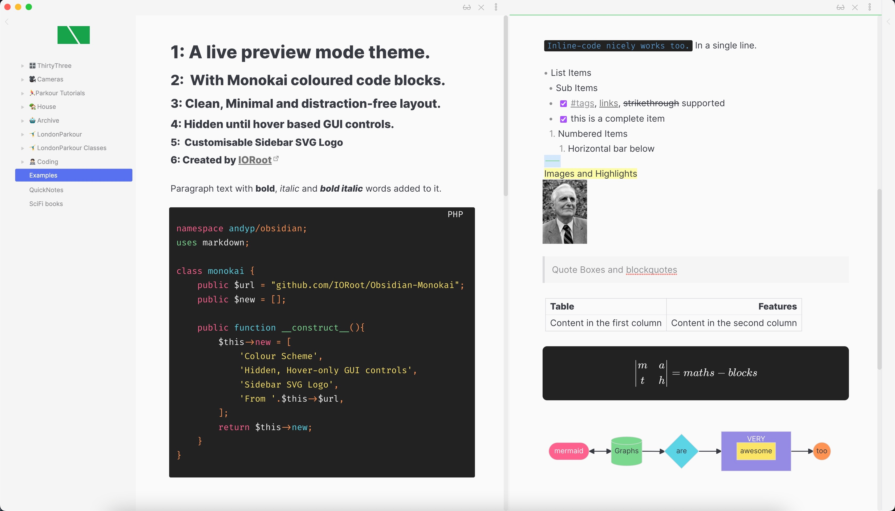

# Monokai Obsidian Theme



A very minimal theme (with a customisable logo) that hides the GUI away until you hover over it.

## The changes

1. Code-block colour palette (Monokai Pro)
1. Custom sidebar SVG Logo.
1. Hide the sidebar dock and action icons until you hover over the workspace ribbon.
1. Hide the sidebar top icons until you hover over the sidebar.
1. Place file-explorer icons at the bottom of sidebar and hide until hover.
1. Hide any Tabs.
1. Highlighted text has border-radius.
1. Seamless colour of Sidebar resizer handle to sidebar colour.
1. Hide title bar (frameless mode)
1. Hide status bar
1. Hide vault name

## Code Colour Scheme

```css
  --gray-1: #5C6370;
  --gray-2: #abb2bf;
  --red: #fc618d;
  --orange: #fd9353;
  --green: #7bd88f;
  --aqua: #5ad4e6;
  --purple: #948ae3;
  --blue: #61afef;
  --yellow: #fce566;
  --white: #f4f4f4;
  --grey-1: #737373;
  --grey-2: #A3A3A3; 
```

## Customise the logo

You can embed your own SVG logo into this themes CSS file.

### Steps:
1. Open up the `monokai.css` file for this theme.
1. At the VERY bottom is the `CUSTOM SVG ICON` CSS rule.
1. You can see the `background-image: url("data:image/svg+xml;base64,[DATA]` rule.
1. You can replace this with your own SVG logo. A good tool to use is https://svgencode.com that will give you the ready-to-go CSS rule with base64 encoding straight away.
1. Save the file and potentially restart obsidian.